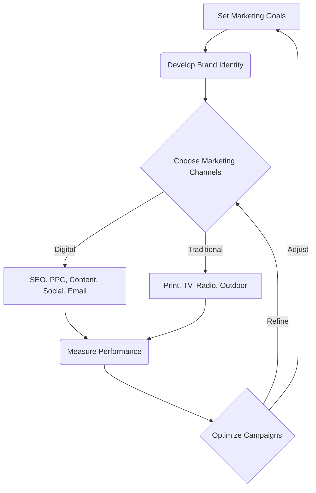

import { Callout, Steps, Step } from "nextra-theme-docs";

# Effective Marketing Strategies

Marketing is the lifeblood of any business. Without effective marketing strategies, even the best products or services can go unnoticed in the marketplace. In this section, we'll explore proven techniques for building your brand and reaching your target customers.

## Understanding Your Target Market

Before you can create effective marketing campaigns, you need to have a deep understanding of your target market. This involves:

<Steps>
### Step 1

Conduct market research to identify your ideal customer profile, including demographics, psychographics, and buying behaviors.

### Step 2

Analyze your competitors to understand their strengths, weaknesses, and positioning in the market.

### Step 3

Create buyer personas that represent your target customers, including their goals, challenges, and decision-making processes.
</Steps>

By having a clear picture of your target market, you can tailor your marketing messages and channels to resonate with them effectively.

## Developing Your Brand Identity

Your brand identity is the foundation of all your marketing efforts. It encompasses your visual elements (logo, color palette, typography), your brand voice and tone, and your core values and mission. 

To develop a strong brand identity:

1. Define your unique value proposition (UVP) - what sets you apart from competitors?
2. Create a consistent visual identity across all touchpoints (website, social media, packaging, etc.)
3. Develop a brand voice and tone that reflects your personality and resonates with your target audience.
4. Communicate your brand story and values through your marketing messages.

A well-defined brand identity builds trust, recognition, and loyalty among your target customers.

## Leveraging Digital Marketing Channels

In today's digital age, leveraging online marketing channels is crucial for reaching and engaging your target audience. Some key digital marketing strategies include:

- Search Engine Optimization (SEO) - optimizing your website and content to rank higher in search engine results pages (SERPs) for relevant keywords.
- Pay-Per-Click (PPC) Advertising - running targeted ads on search engines or social media platforms to drive traffic and conversions.
- Content Marketing - creating valuable, relevant content (blog posts, videos, infographics, etc.) to attract and engage your target audience.
- Social Media Marketing - building a presence on social media platforms to connect with your audience, share content, and drive traffic to your website.
- Email Marketing - nurturing leads and customers through targeted email campaigns, newsletters, and automated sequences.

<Callout>
**Pro Tip:** Develop a comprehensive digital marketing strategy that integrates multiple channels and tactics to maximize your reach and impact.
</Callout>

## Measuring and Optimizing Your Marketing Performance

To ensure your marketing efforts are effective and delivering a positive ROI, it's essential to measure and optimize your performance continuously. This involves:

1. Setting clear, measurable goals and KPIs for each marketing campaign or initiative.
2. Tracking key metrics such as website traffic, conversion rates, engagement rates, and customer acquisition costs (CAC).
3. Using analytics tools to monitor your performance and identify areas for improvement.
4. Conducting A/B tests to optimize your marketing messages, landing pages, and other elements.
5. Regularly reviewing and adjusting your marketing strategies based on data-driven insights.

By adopting a data-driven approach to marketing, you can continually refine and improve your efforts to drive better results for your business.

Effective marketing is an iterative process that requires ongoing optimization and adjustment based on data and insights. By following the strategies outlined in this section and continually measuring and refining your efforts, you can build a strong brand, reach your target customers effectively, and drive long-term growth for your business.

For more insights on specific marketing tactics, check out these subsections:

- [The Art of Selling](/sales-and-marketing/the-art-of-selling)
- [Securing Sponsors and Investors](/sales-and-marketing/securing-sponsors-and-investors)