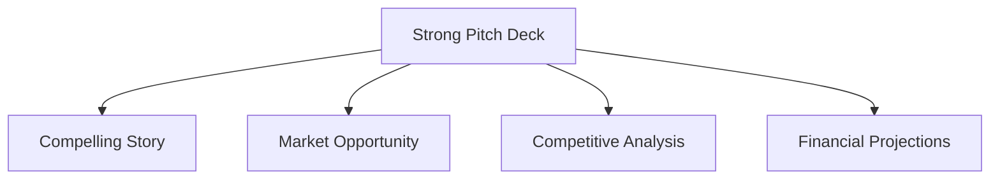

import { Callout, Steps, Step } from "nextra-theme-docs";

# Securing Sponsors and Investors

Securing sponsors and investors is a crucial step in funding the growth of your business. In this section, we'll cover effective strategies for getting sponsors and investors on board.

## Understanding the Motivations of Sponsors and Investors

To successfully secure sponsors and investors, you need to understand their motivations. Sponsors and investors are looking for two key things:

1. **Value Return**: They want to see a return on their investment, whether it's through increased brand visibility (for sponsors) or financial returns (for investors).
2. **Emotional Connection**: They want to feel a personal connection to your business and its mission.

<Callout type="info">
The most powerful pitch combines both a strong value proposition and an emotional connection. Aim to appeal to both the head and the heart of your potential sponsors and investors.
</Callout>

## Strategies for Securing Sponsors

<Steps>

### Step 1: Research Potential Sponsors

Before approaching potential sponsors, do your research. Understand their brand values, target audience, and marketing strategies. Look for sponsors whose values align with your own and whose target audience overlaps with yours.

### Step 2: Tailor Your Pitch

Tailor your pitch to each potential sponsor. Highlight how your business can help them achieve their goals, whether it's increasing brand visibility, reaching a new audience, or promoting a specific product or service.

### Step 3: Offer Value-Added Opportunities

Offer value-added opportunities beyond just logo placement. Consider exclusive content, event activations, or co-branded products that can help sponsors stand out and engage with your audience.

### Step 4: Leverage Existing Relationships

Leverage your existing relationships to secure sponsors. Reach out to brands you've worked with in the past or have a personal connection with. A warm introduction can go a long way in getting your foot in the door.

</Steps>

## Strategies for Securing Investors

<Steps>

### Step 1: Know Your Numbers

Before approaching investors, make sure you have a solid understanding of your business's financials. Be prepared to discuss your revenue, expenses, and growth projections in detail.

### Step 2: Identify the Right Investors

Not all investors are created equal. Look for investors who have experience in your industry and share your vision for the future of your business. Consider factors like investment size, timeline, and level of involvement when identifying potential investors.

### Step 3: Craft a Compelling Pitch Deck

Your pitch deck is your opportunity to tell your business's story and showcase its potential. Include key information like your team, market opportunity, competitive landscape, and financial projections. Use visuals like charts and graphs to make your data easy to understand.

### Step 4: Practice Your Pitch

Practice your pitch until you can deliver it with confidence and clarity. Anticipate potential questions and objections, and be prepared to address them head-on. Remember, investors are looking for founders who are passionate, knowledgeable, and able to execute on their vision.

</Steps>

<Callout type="warning">
Don't forget to consider alternative funding options like crowdfunding, grants, and revenue-based financing. While sponsors and investors can be a great source of capital, they're not the only options available.
</Callout>

By understanding the motivations of sponsors and investors, tailoring your pitch, and leveraging your existing relationships, you can successfully secure the funding you need to grow your business. Remember, securing sponsors and investors is just one piece of the puzzle. Make sure you have a solid [business plan](/starting-a-business) and a strong [team](/building-and-managing-your-team) in place to execute on your vision.