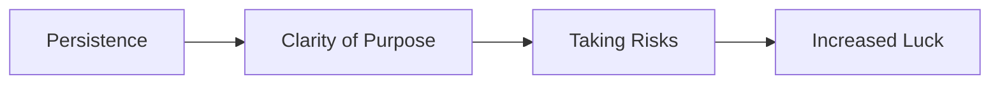

import { Callout, Steps, Step } from "nextra-theme-docs";

# Hacking Luck

Luck may seem like a mysterious force that's out of our control, but the truth is, you can actually *hack* luck to work in your favor. By understanding the key factors that contribute to luck and implementing the right strategies, you can increase your chances of success in business and in life.

<Steps>

### Be Persistent

Persistence is one of the most important factors in hacking luck. When you refuse to give up and keep pushing forward, even in the face of adversity, you open yourself up to more opportunities and increase your chances of success.

**Example:** Colonel Sanders, the founder of KFC, faced rejection 1,009 times before finding a restaurant willing to sell his fried chicken. His persistence paid off, and KFC became a global success.

### Know Your Destination

Having a clear understanding of what success means to you and where you want to go in life is crucial for hacking luck. When you have a specific goal in mind, you can focus your efforts and make better decisions that align with your desired outcome.

**Example:** Steve Jobs had a clear vision for Apple and persistently worked towards creating user-friendly, innovative products. His clarity of purpose helped him make the right decisions and attract the right opportunities.

### Take Risks

Taking calculated risks is essential for hacking luck. When you step out of your comfort zone and try new things, you open yourself up to new possibilities and increase your chances of stumbling upon a lucky break.

**Example:** Richard Branson, the founder of Virgin Group, has taken numerous risks throughout his career, from starting a mail-order record business to launching an airline. His willingness to take risks has led to tremendous success and luck in his ventures.

</Steps>

<Callout type="warning">
Be careful not to confuse taking risks with recklessness. Always assess the potential outcomes and make informed decisions based on your goals and resources.
</Callout>

## The Luck Formula

By combining persistence, clarity of purpose, and a willingness to take risks, you can create a powerful formula for hacking luck in your favor. Remember, luck isn't just about chance – it's about putting yourself in the right position to seize opportunities when they arise.

For more on winning strategies, check out [Delayed Gratification](/winning-strategies/delayed-gratification) and learn how to build a sustainable business by playing the long game.